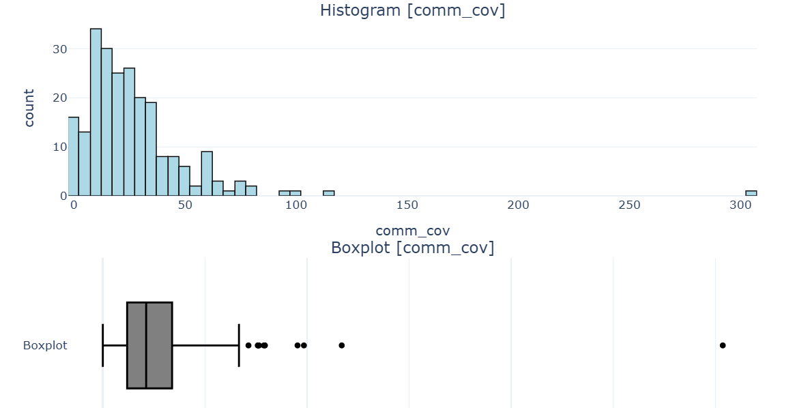
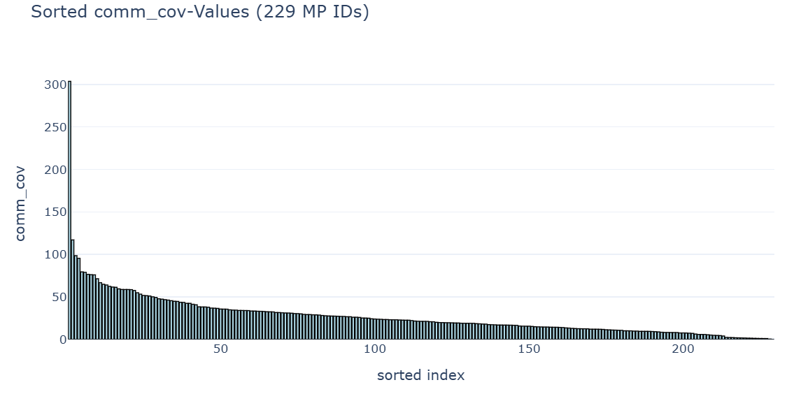
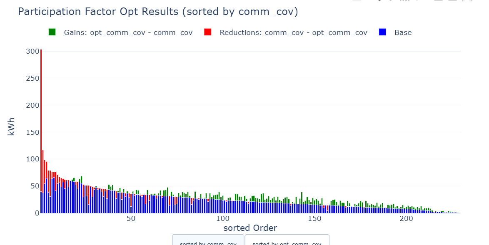
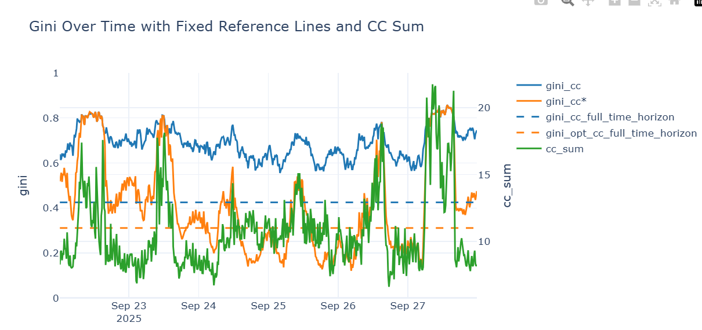
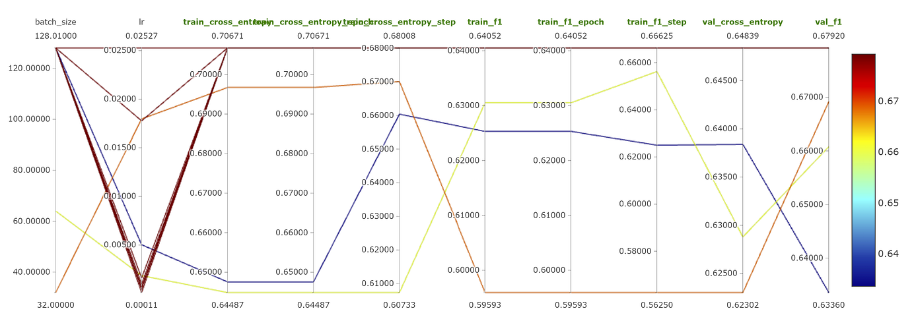

# Dashboard for visualising the impact of the optimisation algorithm

## Visualisation of a single algorithm
### Starting situation

+ source of the functions in src/notebooks/gate3/Gate3.ipynb

### After optimisation
#### Energy amounts

+ Filtering of timestamps to display different optimisation targets per time horizon
+ source of the function: src/modules/pf_calculations.py -> plot_stacked_gain_loss_sortable

#### Fairness metrics

+ Implementation: independent of the metric used / the metric is interchangeable
+ source of the functions in src/notebooks/gate3/Gate3.ipynb

## Comparison of different algorithms

+ Inspiration

